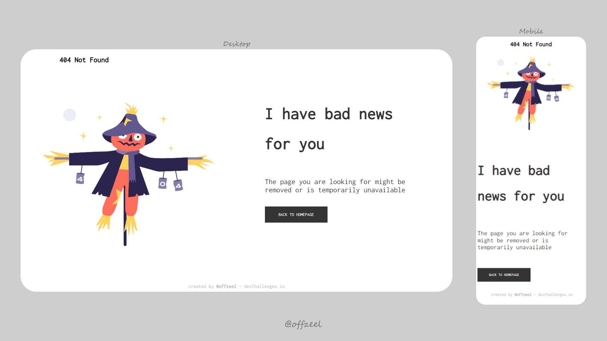

<h1 align="center">404 - Not Found</h1>

<p align="center">Desafio de DevChallenges</p>

<p align="center">
  
  
  
  
</p>

<p align="center">
  
</p>

<h1 align="center">Descrição do Projeto</h1>

```
Challenge: Create a 404 not found page following the design. The page should be responsive. Don’t look at the existing solution.
```

<p>completei o desafio proposto pela DevChallenge BR e implementei uma 'loadscreen', e um sistema mais completo de verificação de email e senha. </p>

<h1 align="center">Deploy do Projeto</h1>

> Link do deploy da aplicação: https://luisfsjr.github.io/Project-404-Not-Found/
